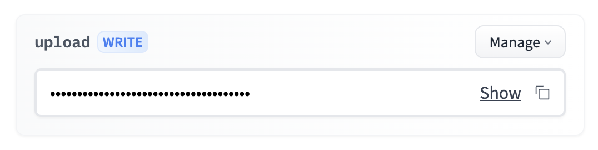

# bop-benchmark
Toolkit to download/upload datasets for BOP benchmark 

The official tutorial to download/upload datasets to HuggingFace Hub is available [here](https://huggingface.co/datasets/bop-benchmark/datasets). This tutorial provides a brief overview of the process for working with [BOP's HuggingFace Hub](https://huggingface.co/datasets/bop-benchmark/datasets/).

```
pip install -U "huggingface_hub[cli]"
```
## Uploading datasets
### 1. Log-in and create a token
```
huggingface-cli login
```
Then go to [this link](https://huggingface.co/settings/tokens) and generate a token. IMPORTANT: the token should have write access as shown below:




Make sure you are in the bop-benchmark group by running:
```
huggingface-cli whoami
```
### 2. Upload
The command is applied for both folders and specific files:
```
# Usage:  huggingface-cli upload [repo_id] [local_path] [path_in_repo] --repo-type=dataset -commit-message="message"
```
For example, to upload MegaPose-GSO:
```
export LOCAL_FOLDER=~/datasets/MegaPose-GSO
export HF_FOLDER=/MegaPose-GSO
huggingface-cli upload bop-benchmark/datasets $LOCAL_FOLDER $HF_FOLDER --repo-type=dataset -commit-message="Upload MegaPose-GSO"
```
